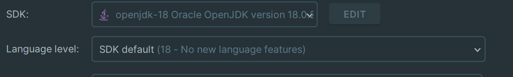
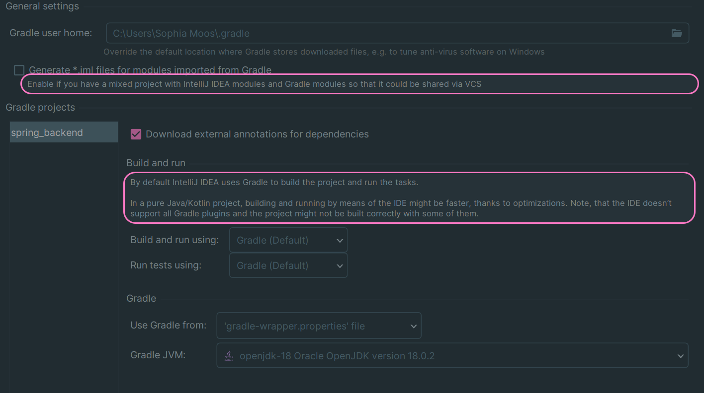

# README #

## Installation Guide

Before you start the Spring boot application you have to execute the follow docker command, in your command promt.

**Docker command**
```
docker run --name postgres_db -e POSTGRES_USER=postgres -e POSTGRES_PASSWORD=postgres -p 5432:5432 -d postgres
```
If everything was successful you should receive a message like this:
```
0baee03d98889aa965aa5f865407cf1e1ed6fbc4bb0a49861ad81a2181e2bf46
```
This is the new created container, which is running.
After this you can start your Application. If you are facing problems go through this checklist, maybe it will help.

**Checklist**

1. make sure you are using jdk 18 -> In IntelliJ go to: menu, File, Project Structure, Project and then make sure it looks like this:
 

2. make sure gradle is running on jdk 18 -> in IntelliJ go to: menu, File, Setting, type into the searchbar "gradle", and make sure it looks something like this:


3. restart your IDE
4. delete the .gradle folder and then restart the IDE and build the project
5. If you receive an error message like this:
```
org.postgresql.util.PSQLException: ERROR: relation "role_authority" does not exist
```
Simply restart the application. Hibernate sometimes does not initialize the tables fast enough an can causes errors like this.